# Face Recognition Project
<h3>Проект для распознавания лиц и генерации эмбеддингов</h3>

## Цель проекта

**Задача:** Получить эмбединг всех лиц, содержащихся на изображении.

## Структура проекта

```
face_recognition_project_2/
├── notebooks/          # Jupyter-ноутбуки с исследованиями и пайплайнами
├── models/            # Предобученные модели
├── images/             # Примеры и результаты
└── README.md          # Документация проекта
```

## Использование

### Основные ноутбуки:

| Ноутбук | Описание |
|---------|----------|
| `face-recognition-full-pipeline.ipynb` | Полный пайплайн: выравнивание лиц и получение эмбедингов 
| `arcface-model.ipynb` | Обучение модели для генерации эмбедингов 
| `face-key-points.ipynb` | Детекция ключевых точек лица 

### Модели

| Модель | Назначение | Архитектура |
|--------|------------|-------------|
| `face_emb_model` | Генерация эмбеддингов лиц | ResNet101 + ArcFace |
| `eyes_model_v3.pt` | Детекция координат глаз | ResNet50 |


---

## Face Embedding Model

> **Архитектура:** ResNet101 с ArcFace Loss для оптимального распределения эмбедингов

### Обучение

- **Модель:** ResNet101 с ArcFace Loss
- **Датасет:** Урезанный CelebA (500 классов)
- **Аугментации:** Color Jitter, Random Horizontal Flip
- **Цель:** Лучшее распределение эмбедингов в пространстве признаков

<div align="center">
  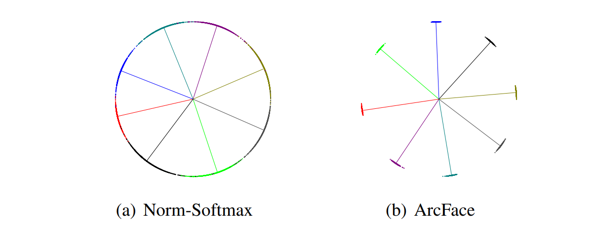
  <p><em>Архитектура модели эмбедингов</em></p>
</div>


### Результаты

<div align="center">
Метрика: Identification Rate (IR)

| False Positive Rate | Left Threshold | True Positive Rate |
|:---------------------:|:-----------------:|:--------------------:|
| **0.05** | 0.236 | **46.5%** |
| **0.10** | 0.193 | **58.8%** |
| **0.20** | 0.146 | **72.5%** |

</div>

<div align="center">
  <table>
    <tr>
      <td>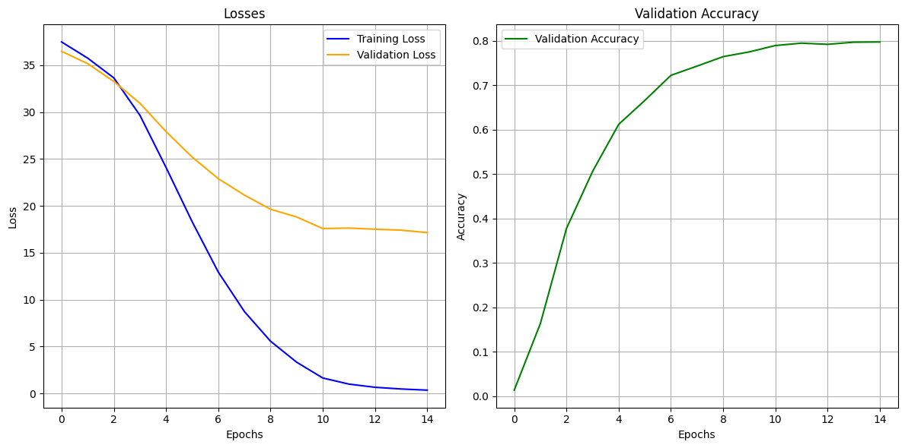</td>
      <td>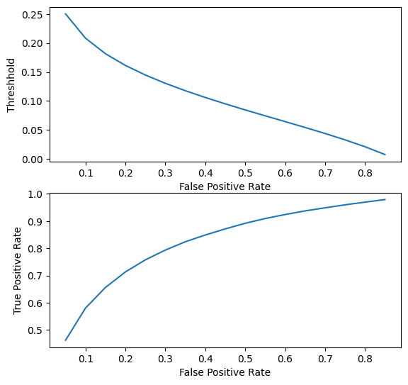</td>
    </tr>
    <tr>
      <td align="center"><em>График loss и accuracy на train и valid выборках</em></td>
      <td align="center"><em>Результаты тестирования на лицах не присутствующих при обучении</em></td>
    </tr>
  </table>
</div>

---

## Face Keypoints Detection Model

> **Задача:** Детекция 12 ключевых точек глаз для выравнивания лиц

### Технические детали

- **Архитектура:** ResNet50
- **Датасет:** Helen Dataset
- **Точки:** 12 ключевых точек глаз
- **Аугментации:** 
  - Случайная обрезка изображения
  - Color Jitter
  - Случайные повороты
- **Loss Function:** MSE Loss
- **Нормализация:** Координаты нормированы на размеры изображения

### Результаты

<div align="center">
  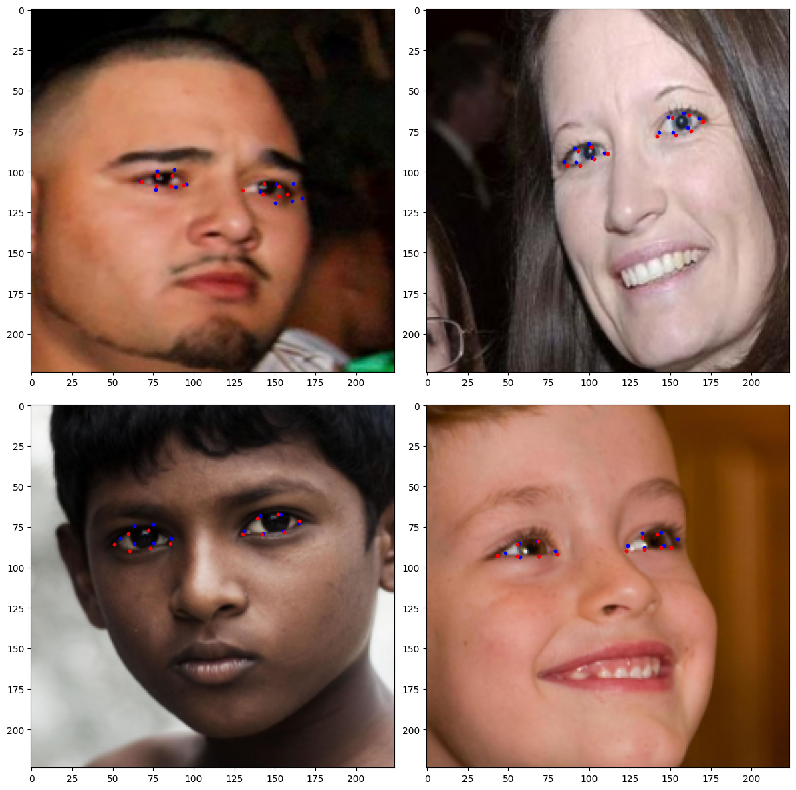
  <p><em>Синие точки - предсказания модели</em></p>
</div>

---

## Full Pipeline

### Алгоритм работы

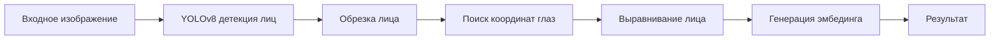

### Пошаговое описание

| Шаг | Операция | Инструмент |
|:---:|----------|------------|
| **1** | Детектируем лицо | YOLOv8 |
| **2** | Обрезаем изображение | Bounding Box |
| **3** | Находим координаты глаз | ResNet50 |
| **4** | Выравниваем лицо | Geometric Transform |
| **5** | Генерируем эмбединг | ResNet101 + ArcFace |

### Метрика схожести

**Косинусная близость** используется для определения похожести лиц:

```python
def cos_sim(a, b):
    """
    Вычисляет косинусную близость между двумя векторами
    
    Args:
        a, b: эмбединги лиц
    
    Returns:
        float: косинусная близость (от -1 до 1)
    """
    dot_product = np.dot(a, b)
    norm_a = np.linalg.norm(a)
    norm_b = np.linalg.norm(b)
    if norm_a == 0 or norm_b == 0:
        return 0.0
    return dot_product / (norm_a * norm_b)
```

> **Принцип:** Эмбединги лиц одного человека должны иметь **большую** косинусную близость между собой, чем эмбединги разных людей.

---

## Примеры работы

### Эксперимент 1

<div align="center">
  <table>
    <tr>
      <td>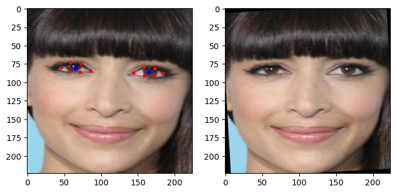</td>
      <td>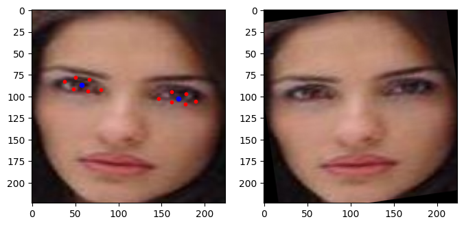</td>
      <td>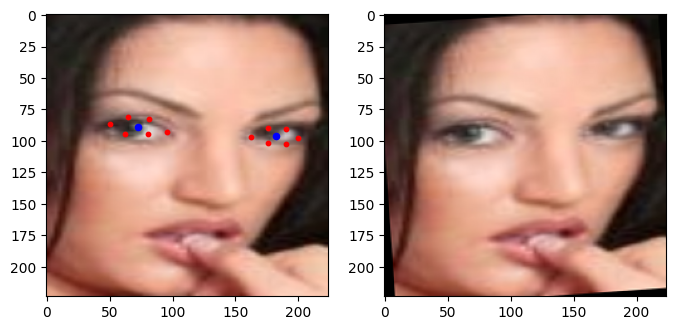</td>
    </tr>
    <tr>
      <td align="center"><em>Первое лицо</em></td>
      <td align="center"><em>Второе лицо</em></td>
      <td align="center"><em>Третье лицо</em></td>
    </tr>
  </table>
</div>

**Результаты косинусной близости:**
```
Одинаковые лица: 0.199
Разные лица 1:  -0.001  
Разные лица 2:   0.134
```

### Эксперимент 2

<div align="center">
  <table>
    <tr>
      <td>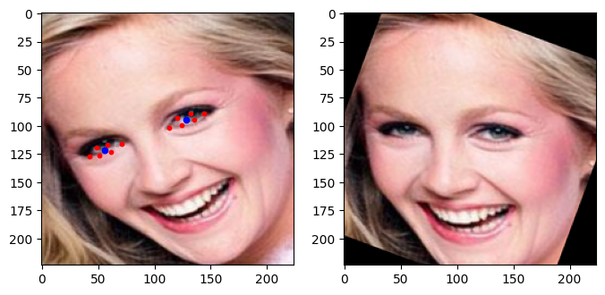</td>
      <td>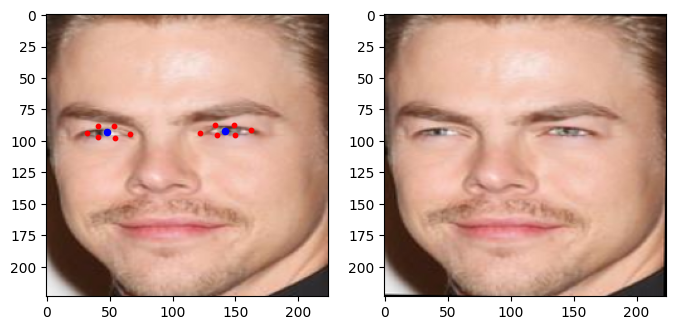</td>
      <td>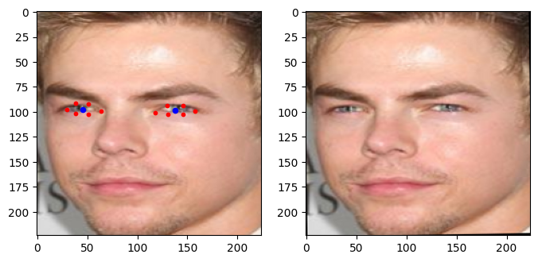</td>
    </tr>
    <tr>
      <td align="center"><em>Первое лицо</em></td>
      <td align="center"><em>Второе лицо</em></td>
      <td align="center"><em>Третье лицо</em></td>
    </tr>
  </table>
</div>

**Результаты косинусной близости:**
```
Одинаковые лица: 0.386
Разные лица 1:   0.170
Разные лица 2:  -0.005
```

### Выводы

> **Успешно:** Векторы одного класса имеют **меньший угол** между собой (большую косинусную близость), чем векторы разных классов
> 
> **Качество:** Модель успешно различает лица разных людей и группирует изображения одного человека

---